# **MARL Jammer System — Complete Working Pipeline**

**Multi-Agent Reinforcement Learning for Enemy Drone Swarm Communication Disruption**

PPO Actor–Critic | Graph Laplacian Reward | FSPL Jamming | DBSCAN Clustering

---

# **1. System Overview**

## **1.1 Project Goal**

The objective of this system is to **detect and disrupt enemy drone swarm communication** using a team of cooperative jammer drones controlled by Multi-Agent Reinforcement Learning (MARL).

The system achieves this through four interconnected pillars:

1. **Detection:** Identify enemy drone positions and model their communication network as a mathematical graph.
2. **Disruption:** Deploy jammer drones that emit interference signals to break communication links between enemy drones.
3. **Coordination:** Use MARL so that multiple jammer agents learn to cooperate — spreading out across clusters, selecting correct frequencies, and maximizing coverage.
4. **Measurement:** Use graph theory (specifically the algebraic connectivity λ₂) to precisely quantify how much the enemy swarm's communication has been degraded.

## **1.2 Why This Approach?**

Traditional jamming uses fixed-position jammers or manually controlled drones. This approach fails when:

- The enemy swarm is large (30–100 drones)
- The swarm moves dynamically
- The swarm uses multiple frequency bands
- Human operators cannot react fast enough

Our system replaces human decision-making with **trained neural network policies** that can react in milliseconds, coordinate multiple jammers simultaneously, and adapt to changing swarm configurations.

## **1.3 High-Level System Flow**

The entire system operates as a closed loop. At every timestep, the following cycle repeats:


**Reading this diagram:**

1. The **Environment** contains enemy drones, jammer drones, communication links, and the arena.
2. Each jammer agent **observes** a 5-dimensional state vector describing its local situation.
3. The **Agent Policy** (a neural network) processes this observation and outputs an action.
4. The **Action** consists of a velocity vector (where to move) and a frequency band selection (which frequency to jam).
5. The **Environment Updates** — jammer positions change, enemy drones move, communication links are recalculated.
6. A **Reward** is computed based on how much the enemy's connectivity (λ₂) has decreased.
7. During training, the reward signal is used to **update the neural network weights** via PPO (Proximal Policy Optimization).
8. The loop repeats for thousands of episodes until the agents learn an effective jamming strategy.

## **1.4 Complete System Architecture**

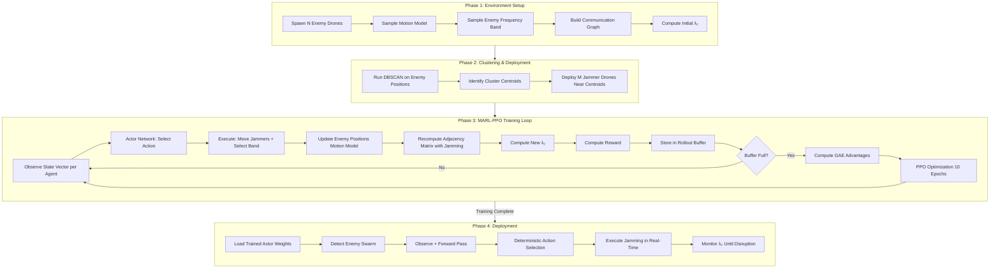

---

# **2. Enemy Drone Swarm Modeling**

## **2.1 What is a Drone Swarm?**

An enemy drone swarm is a group of **N autonomous drones** (default N=30) that fly in a shared airspace and communicate with each other to coordinate their actions — formation flight, target tracking, coordinated attacks, etc.

For the swarm to function as a coordinated unit, every drone must be able to communicate with at least some other drones. If we can **break enough communication links**, the swarm fragments into isolated groups that can no longer coordinate.

## **2.2 Modeling the Swarm as a Communication Graph**

We represent the swarm as a **mathematical graph** G = (V, E):

- **Nodes (V):** Each enemy drone is a node. If there are N=30 drones, we have 30 nodes labeled 1, 2, ..., 30.
- **Edges (E):** A communication link between drone i and drone j exists **if and only if** the received signal power between them exceeds a sensitivity threshold.

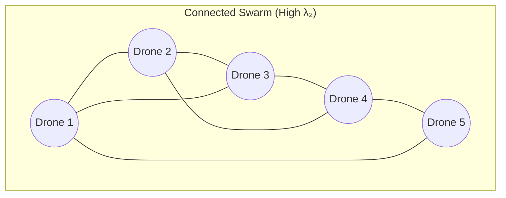

### **How Edges Are Created**

An edge between drone i and drone j is created based on the **Free-Space Path Loss (FSPL)** model:

1. **Compute distance:** $d_{ij} = \|x_i - x_j\|_2$ (Euclidean distance in meters)

2. **Compute received power:** Using the FSPL formula:
   $$P_R(i,j) = P_{tx} \cdot \left(\frac{c}{4\pi f \cdot d_{ij}}\right)^2$$
   where $P_{tx}$ = transmit power, $f$ = carrier frequency, $c$ = speed of light.

3. **Edge decision:** The link exists if:
   $$P_R(i,j) \geq P_{sens}$$
   where $P_{sens}$ = receiver sensitivity threshold (default: -90 dBm).

This means drones that are **close together** have strong links, and drones that are **far apart** have no link (the signal is too weak).

## **2.3 Adjacency Matrix**

The adjacency matrix **A** is an N×N matrix that encodes all communication links:

$$A[i,j] = \begin{cases} 1 & \text{if } P_R(i,j) \geq P_{sens} \text{ and link not jammed} \\ 0 & \text{otherwise} \end{cases}$$

**Example** (5 drones):

```
A = | 0  1  1  0  0 |
    | 1  0  1  1  0 |
    | 1  1  0  0  1 |
    | 0  1  0  0  1 |
    | 0  0  1  1  0 |
```

Reading this: Drone 1 can talk to Drones 2 and 3. Drone 2 can talk to Drones 1, 3, and 4. And so on.

## **2.4 Degree Matrix**

The degree matrix **D** is a diagonal matrix where each diagonal entry counts how many connections that drone has:

$$D[i,i] = \sum_{j \neq i} A[i,j]$$

From the example above:

```
D = | 2  0  0  0  0 |
    | 0  3  0  0  0 |
    | 0  0  3  0  0 |
    | 0  0  0  2  0 |
    | 0  0  0  0  2 |
```

Drone 2 has degree 3 (connected to three other drones). Drone 1 has degree 2.

## **2.5 Laplacian Matrix**

The **Graph Laplacian** is defined as:

$$L = D - A$$

This matrix has special mathematical properties that encode the connectivity structure of the graph. Key properties:

- L is symmetric and positive semi-definite
- L always has at least one zero eigenvalue
- The number of zero eigenvalues equals the number of disconnected components

## **2.6 Algebraic Connectivity (λ₂) — The Key Metric**

The eigenvalues of the Laplacian L are sorted as:

$$0 = \lambda_1 \leq \lambda_2 \leq \lambda_3 \leq \dots \leq \lambda_N$$

The **second smallest eigenvalue** $\lambda_2$ is called the **Fiedler value** or **algebraic connectivity**. This single number tells us everything about how well-connected the swarm is:

| λ₂ Value                     | Interpretation     | Swarm Status                            |
| ---------------------------- | ------------------ | --------------------------------------- |
| λ₂ >> 0 (e.g., 15–30)        | High connectivity  | Swarm fully operational, fault-tolerant |
| λ₂ > 0 but small (e.g., 1–5) | Weakly connected   | Swarm vulnerable, coordination degraded |
| λ₂ → 0                       | Near disconnection | Swarm about to fragment                 |
| λ₂ = 0                       | **Disconnected**   | **Swarm fragmented — mission success**  |

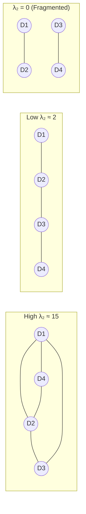

**Why λ₂ and not some other metric?**

By Fiedler's theorem (1973), λ₂ = 0 is a **necessary and sufficient condition** for graph disconnection. This means:

- If λ₂ = 0, the enemy swarm **cannot** coordinate globally. Guaranteed.
- No other single metric provides this mathematical guarantee.

**Our goal:** Drive λ₂ from its initial value λ₂(0) down to 0 (or as close to 0 as possible).

## **2.7 Enemy Swarm Motion**

Enemy drones are not stationary — they move over time:

**Random Walk Model:**
$$x_i(t+1) = \text{clip}(x_i(t) + \eta_i(t), \; 0, \; \text{arena\_size})$$

where $\eta_i(t) \sim \text{Uniform}(-v_{enemy}, +v_{enemy})^2$ and $v_{enemy} = 2.0$ m/s.

This means:

- Enemy drones drift randomly within the arena
- Cluster structures change over time
- Jammers must continuously reposition to track moving targets
- The problem is harder than jamming static drones

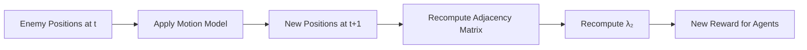

---

# **3. Cluster Detection Using DBSCAN**

## **3.1 Why Clustering is Required**

With 30 enemy drones spread across a 180m × 180m arena, we cannot assign one jammer to each drone (we only have 6 jammers). We need a smarter strategy:

1. **Group nearby enemies into clusters** — drones that are close together form natural communication hubs.
2. **Identify cluster centers** — the geographic center of each cluster.
3. **Deploy jammers near cluster centers** — one jammer near a cluster center can disrupt many communication links simultaneously.

This is far more efficient than random placement.

## **3.2 DBSCAN Algorithm Explained**

DBSCAN (Density-Based Spatial Clustering of Applications with Noise) groups nearby points into clusters without requiring a predefined number of clusters.

**Parameters:**

- **eps (ε) = 30m:** If two drones are within 30 meters, they are considered neighbors.
- **min_samples = 2:** At least 2 drones within ε distance are needed to form a cluster.

**Point Classification:**

| Point Type       | Definition                                               | Example                                |
| ---------------- | -------------------------------------------------------- | -------------------------------------- |
| **Core Point**   | Has ≥ min_samples neighbors within ε                     | A drone with 3 other drones within 30m |
| **Border Point** | Within ε of a core point but has < min_samples neighbors | A drone near a cluster but at the edge |
| **Noise Point**  | Not within ε of any core point                           | An isolated drone far from all others  |

**How DBSCAN Works Step-by-Step:**

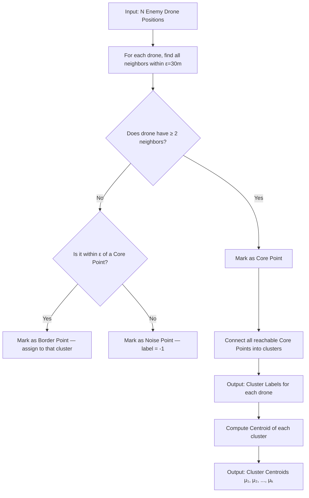

## **3.3 From Clusters to Jammer Deployment**

Once we have cluster centroids, we deploy jammer drones:

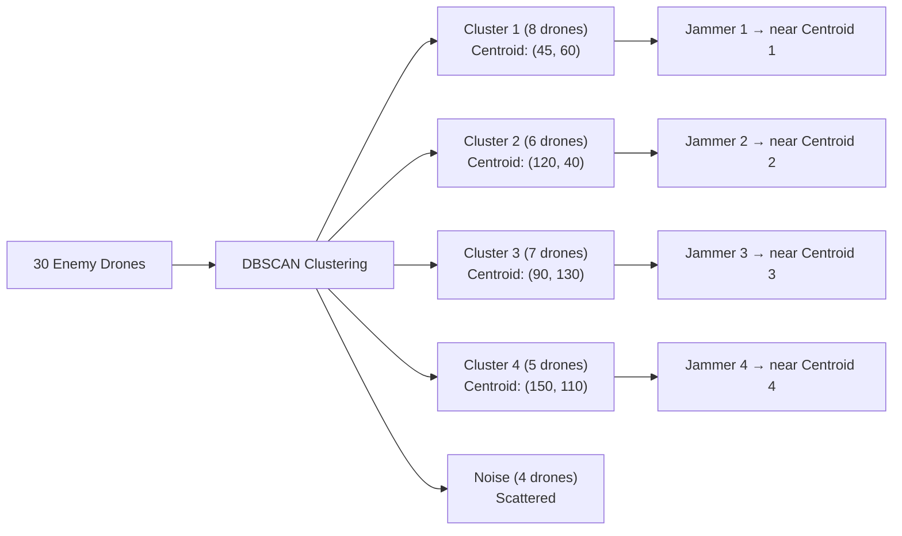

**Key insight:** DBSCAN is **re-run periodically** (every 10 steps) because enemies move. As clusters shift, jammer assignments are updated.

---

# **4. Jammer Drone Agents**

## **4.1 Role of Jammer Drones**

Each jammer drone is an autonomous agent controlled by a trained neural network. Its mission:

1. **Position itself** near the center of an enemy cluster
2. **Select the correct frequency band** that matches the enemy's communication frequency
3. **Emit jamming signals** that drown out enemy-to-enemy communications
4. **Coordinate with other jammers** to maximize coverage and minimize overlap

## **4.2 Agent Configuration**

| Property              | Value                  | Description                                |
| --------------------- | ---------------------- | ------------------------------------------ |
| Number of agents (M)  | 6                      | Six jammer drones operating simultaneously |
| Maximum speed         | 5.0 m/s                | Per-axis velocity limit                    |
| Frequency bands       | 4                      | {433 MHz, 915 MHz, 2.4 GHz, 5.8 GHz}       |
| Jammer transmit power | 30 dBm (1 Watt)        | RF output power                            |
| Initial position      | Near cluster centroids | DBSCAN-guided deployment                   |
| Arena bounds          | [0, 180m] × [0, 180m]  | Hard-clipped at boundaries                 |

## **4.3 How Jamming Works**

A jammer disrupts a communication link between enemy drones i and j if **two conditions** are met:

1. **Power condition:** The jamming signal received at the midpoint of link (i,j) exceeds the jamming threshold:
   $$P_{jam}(k, i, j) = P_{jammer} \cdot \left(\frac{c}{4\pi f_{jam} \cdot d_{km}}\right)^2 \geq P_{jam\_thresh}$$
   where $d_{km}$ = distance from jammer k to the midpoint of link (i,j).

2. **Frequency condition:** The jammer must be transmitting on the **same frequency band** as the enemy swarm:
   $$\text{band}_k = \text{band}_{enemy}$$

**Critical design point:** If a jammer selects the **wrong frequency band**, it has **zero jamming effect** regardless of how close it is. This forces the agents to learn frequency selection.

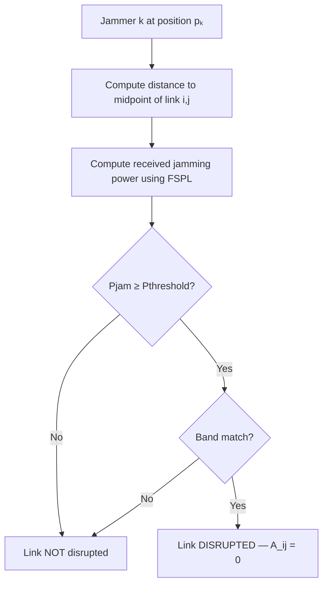

---

# **5. State Space (Observation Space)**

## **5.1 What Each Agent Sees**

Each jammer agent observes a **5-dimensional normalized vector** at every timestep. This is the input to its neural network. All values are normalized to the range [0, 1].

## **5.2 The Five State Variables**

| Index | Feature            | Computation                                                  | Range  | Purpose                                               |
| ----- | ------------------ | ------------------------------------------------------------ | ------ | ----------------------------------------------------- |
| 0     | `dist_to_centroid` | Distance to nearest cluster center, divided by arena size    | [0, 1] | Tells the agent how far it is from its target cluster |
| 1     | `cluster_density`  | Number of enemies in assigned cluster / total enemies N      | [0, 1] | Tells the agent how important its current target is   |
| 2     | `dist_to_others`   | Average distance to all other jammer agents / arena size     | [0, 1] | Coordination signal — prevents clustering of jammers  |
| 3     | `coverage_overlap` | Fraction of jammer pairs that are too close (within 2×R_jam) | [0, 1] | Penalizes jammers that overlap in coverage area       |
| 4     | `band_match`       | 1 if agent's selected band matches enemy band, 0 otherwise   | {0, 1} | Immediate feedback on frequency selection             |

## **5.3 Why These Five Features?**

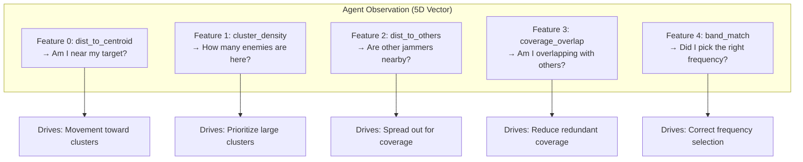

**Feature 0 (dist_to_centroid):** This is the most critical feature. It provides the agent with a gradient — the closer it gets to a cluster center, the lower this value, and the higher the expected reward. Without this feature, the agent would have no directional guidance.

**Feature 1 (cluster_density):** This tells the agent whether its assigned cluster is worth targeting. A cluster with 10 drones is a higher-priority target than a cluster with 2 drones.

**Feature 2 (dist_to_others):** This enables implicit coordination between agents. If all agents see that they are close to each other, they learn to spread out.

**Feature 3 (coverage_overlap):** This directly penalizes the situation where two jammers cover the same area, wasting one jammer's capabilities.

**Feature 4 (band_match):** Binary signal. The agent immediately knows whether its current frequency selection is correct. This accelerates frequency learning.

## **5.4 Dynamic Nature of Observations**

Because enemies move, Features 0 and 1 **change at every timestep**, not just at episode reset. This means the agent must learn:

- **Tracking behavior** — continuously adjust position as clusters shift
- **Not just one-time positioning** — the optimal position changes over time

---

# **6. Action Space**

## **6.1 What Each Agent Decides**

At every timestep, each jammer agent outputs **two types of actions**:

### **Continuous Action: Velocity (Vx, Vy)**

The agent chooses a velocity vector determining how it moves in the 2D arena:

$$V_x, V_y \sim \mathcal{N}(\mu_\theta(s_j), \sigma_\theta(s_j))$$

- During **training:** velocities are sampled from a Gaussian distribution (for exploration)
- During **deployment:** velocities are the mean μ (deterministic, no randomness)
- Clipped to $[-v_{max}, +v_{max}]$ where $v_{max} = 5.0$ m/s

Position update: $p_j(t+1) = \text{clip}(p_j(t) + [V_x, V_y], \; 0, \; \text{arena\_size})$

### **Discrete Action: Frequency Band Selection**

The agent selects one of 4 frequency bands:

$$\text{band}_j \sim \text{Categorical}(\text{softmax}(\text{logits}_j(s_j)))$$

| Band Index | Frequency | Use Case                         |
| ---------- | --------- | -------------------------------- |
| 0          | 433 MHz   | Long-range, wide coverage        |
| 1          | 915 MHz   | Medium range                     |
| 2          | 2.4 GHz   | Common drone frequency (default) |
| 3          | 5.8 GHz   | Short-range, precise targeting   |

The agent must learn to match the enemy's frequency. Wrong band = zero disruption.

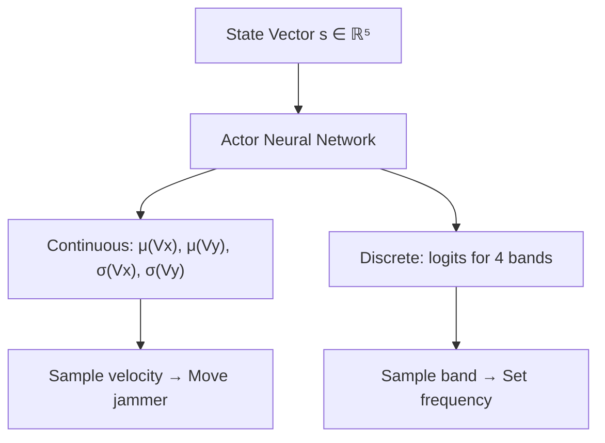

---

# **7. Reward Function**

## **7.1 The Complete Reward Equation**

The reward is **shared** among all agents (team reward) and computed at each timestep:

$$R(t) = \omega_1 \cdot \left(1 - \frac{\lambda_2(t)}{\lambda_2(0)}\right) + \omega_2 \cdot \frac{1}{M}\sum_{k=1}^{M}\mathbb{1}[\text{band}_k = \text{band}_{enemy}] + \omega_3 \cdot \frac{1}{M}\sum_{k=1}^{M}e^{-\kappa \cdot d(\mu_k, p_k)} - \omega_4 \cdot \frac{1}{M}\sum_{k=1}^{M}\frac{\|v_k\|^2}{v_{max}^2} - \omega_5 \cdot \text{overlap\_penalty}$$

## **7.2 Term-by-Term Explanation**

### **Term 1: Connectivity Reduction (ω₁ = 1.0) — THE PRIMARY OBJECTIVE**

$$R_1 = 1 - \frac{\lambda_2(t)}{\lambda_2(0)}$$

| Situation          | λ₂(t)       | R₁ Value | Meaning        |
| ------------------ | ----------- | -------- | -------------- |
| No disruption      | λ₂(0)       | 0.0      | No progress    |
| 50% reduction      | 0.5 × λ₂(0) | 0.5      | Good progress  |
| 90% reduction      | 0.1 × λ₂(0) | 0.9      | Excellent      |
| Full disconnection | 0           | 1.0      | Maximum reward |

This term provides a continuous gradient from 0 to 1, guiding the agent to progressively reduce connectivity.

### **Term 2: Band Match Bonus (ω₂ = 0.3)**

$$R_2 = \frac{1}{M}\sum_{k=1}^{M}\mathbb{1}[\text{band}_k = \text{band}_{enemy}]$$

If 4 out of 6 jammers select the correct band: R₂ = 4/6 = 0.67. This directly rewards correct frequency selection.

### **Term 3: Proximity Reward (ω₃ = 0.2)**

$$R_3 = \frac{1}{M}\sum_{k=1}^{M}e^{-\kappa \cdot d(\mu_k, p_k)}$$

This is an exponential decay — the closer jammer k is to its assigned cluster centroid μₖ, the higher the reward. When distance = 0, R₃ = 1.0. When distance is large, R₃ → 0.

### **Term 4: Energy Penalty (ω₄ = 0.1)**

$$R_4 = -\frac{1}{M}\sum_{k=1}^{M}\frac{\|v_k\|^2}{v_{max}^2}$$

Moving fast costs energy. This term penalizes unnecessary movement. Once a jammer reaches its optimal position, it should hover (v ≈ 0) rather than waste energy.

### **Term 5: Overlap Penalty (ω₅ = 0.2)**

$$R_5 = -\text{fraction of jammer pairs within } 2 \times R_{jam}$$

If two jammers are too close, they cover the same area — wasting one jammer. This penalty encourages spatial spreading.

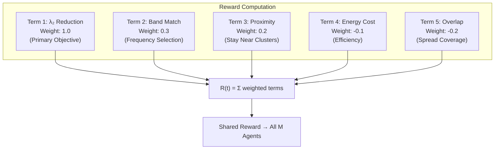

---

# **8. Training Architecture**

## **8.1 Why Neural Networks?**

In simple reinforcement learning (like Q-learning or tabular methods), we store a value for every possible state-action pair in a table. This fails here because:

1. **Continuous state space:** The observation vector is 5 real-valued numbers. There are infinitely many possible states — we cannot build a table for all of them.
2. **Continuous action space:** Velocities (Vx, Vy) are continuous. We cannot enumerate all possible velocities.
3. **Generalization:** A neural network can **interpolate** — if it learns that position (50, 60) is good, it infers that (51, 61) is probably also good. Tables cannot do this.

## **8.2 Network Architecture**

Both the Actor and Critic share a similar structure:

```
Input Layer:  5 neurons (one per state feature)
    ↓
Hidden Layer 1: FC(5 → 128) → LayerNorm → ReLU
    ↓
Hidden Layer 2: FC(128 → 128) → LayerNorm → ReLU
    ↓
Output Layer:  (depends on Actor vs Critic)
```

**Why LayerNorm and not BatchNorm?**

In multi-agent training with parameter sharing, batch sizes vary and agents provide different statistics. LayerNorm normalizes per-sample rather than per-batch, making it more stable.

**Why ReLU activation?**

ReLU (Rectified Linear Unit) is simple, fast, and avoids the vanishing gradient problem. For the hidden layers, ReLU provides non-linearity without the computational cost of sigmoid or tanh.

---

# **9. Actor–Critic Architecture**

## **9.1 The Actor Network (Policy Network)**

The Actor takes a state observation and outputs an **action distribution**:

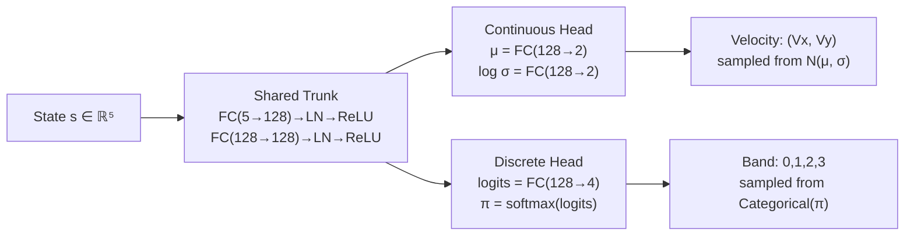

**Continuous Head:** Outputs the mean (μ) and standard deviation (σ) of a Gaussian distribution for each velocity component. During training, actions are sampled for exploration. During deployment, the mean is used directly.

**Discrete Head:** Outputs 4 logits that are passed through softmax to produce probabilities for each frequency band.

**Combined log-probability:**
$$\log \pi(a|s) = \log \mathcal{N}(V_x, V_y \mid \mu, \sigma) + \log \text{Categorical}(\text{band} \mid \pi)$$

## **9.2 The Critic Network (Value Network)**

The Critic estimates the expected future reward from a given state:

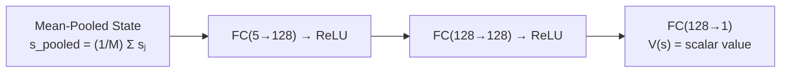

**Why mean-pooled input?**

The state from all M agents is averaged into a single 5D vector. This keeps the Critic's input size **fixed** regardless of how many agents exist (M=4 or M=40 — same input size). This enables scalability.

**What does V(s) represent?**

The Critic predicts: "Starting from this state, if we follow our current policy, what is the total reward we expect to receive for the rest of the episode?"

## **9.3 How Actor and Critic Interact**

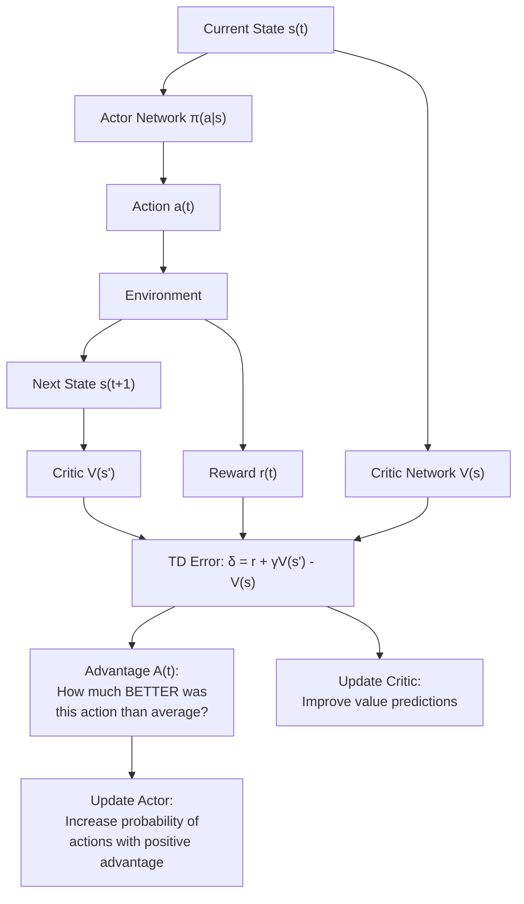

**The key interaction:**

1. The **Actor** chooses actions (what to do)
2. The **Critic** evaluates states (how good is this situation?)
3. The **difference** between the Critic's prediction and actual outcome tells us whether the action was better or worse than expected
4. We use this signal to improve both networks

---

# **10. Advantage Estimation (GAE)**

## **10.1 TD Error — The Basic Building Block**

The Temporal Difference (TD) error measures the "surprise" at each timestep:

$$\delta_t = r_t + \gamma \cdot V(s_{t+1}) \cdot (1 - \text{done}_t) - V(s_t)$$

Where:

- $r_t$ = immediate reward at time t
- $\gamma = 0.99$ = discount factor (how much we value future vs. present rewards)
- $V(s_{t+1})$ = Critic's value prediction for the next state
- $V(s_t)$ = Critic's value prediction for the current state

**Interpretation:**

- $\delta_t > 0$: "Things went **better** than expected" → the action was good
- $\delta_t < 0$: "Things went **worse** than expected" → the action was bad
- $\delta_t ≈ 0$: "Outcome matched expectations" → action was average

## **10.2 Generalized Advantage Estimation (GAE)**

Instead of using just the one-step TD error, GAE combines many future TD errors to get a more stable estimate:

$$A_t = \delta_t + (\gamma \cdot \lambda_{GAE}) \cdot A_{t+1} \cdot (1 - \text{done}_t)$$

This is computed **backwards** from the last timestep to the first:

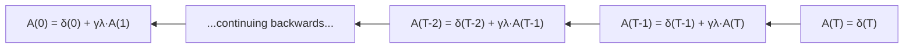

**Parameters:**

- $\gamma = 0.99$ — discount factor
- $\lambda_{GAE} = 0.95$ — GAE smoothing parameter

**Why GAE?**

| Method                             | Bias    | Variance | Quality          |
| ---------------------------------- | ------- | -------- | ---------------- |
| Monte Carlo (full episode returns) | Low     | High     | Noisy gradients  |
| One-step TD                        | High    | Low      | Biased estimates |
| **GAE (λ=0.95)**                   | **Low** | **Low**  | **Best of both** |

GAE provides a smooth tradeoff between bias and variance, resulting in more stable training.

## **10.3 Normalization**

After computing advantages, they are normalized:

$$A_t \leftarrow \frac{A_t - \text{mean}(A)}{\text{std}(A) + 10^{-8}}$$

This ensures advantages have zero mean and unit variance, which makes the PPO optimization more stable.

---

# **11. PPO Optimization**

## **11.1 Why PPO?**

Standard policy gradient methods can make **large destructive updates** — a single bad gradient step can ruin a good policy. PPO (Proximal Policy Optimization) prevents this by **clipping** the policy update to stay close to the previous policy.

## **11.2 The Probability Ratio**

First, we compute how much the policy has changed for each action:

$$r_t(\theta) = \frac{\pi_\theta(a_t | s_t)}{\pi_{\theta_{old}}(a_t | s_t)} = \exp\left(\log\pi_\theta - \log\pi_{\theta_{old}}\right)$$

- If $r_t = 1$: new policy and old policy agree on this action
- If $r_t > 1$: new policy is **more likely** to take this action
- If $r_t < 1$: new policy is **less likely** to take this action

## **11.3 The Clipped Objective**

$$L^{CLIP} = \mathbb{E}\left[\min\left(r_t \cdot A_t, \; \text{clip}(r_t, 1-\epsilon, 1+\epsilon) \cdot A_t\right)\right]$$

Where $\epsilon = 0.2$ (the clip range).

**How clipping works:**

```mermaid
flowchart TB
    A["Compute ratio r(t) = π_new / π_old"] --> B{A(t) > 0?}
    B -->|"Yes (good action)"| C["Want to increase r(t)\nbut clip at 1+ε = 1.2"]
    B -->|"No (bad action)"| D["Want to decrease r(t)\nbut clip at 1-ε = 0.8"]
    C --> E["Policy can change by at most 20%\nin the positive direction"]
    D --> F["Policy can change by at most 20%\nin the negative direction"]
    E --> G["Stable, conservative updates"]
    F --> G
```

**Intuition:** Even if the advantage is very large (indicating a very good action), the policy can only change by 20% per update. This prevents catastrophic policy changes.

## **11.4 Complete PPO Loss Function**

$$L_{total} = -L^{CLIP} + c_1 \cdot L^{value} - c_2 \cdot H(\pi)$$

| Component     | Formula               | Weight       | Purpose                   |
| ------------- | --------------------- | ------------ | ------------------------- |
| Policy loss   | $-L^{CLIP}$           | 1.0          | Improve action selection  |
| Value loss    | $(V_\phi(s) - R_t)^2$ | $c_1 = 0.5$  | Improve value predictions |
| Entropy bonus | $-H(\pi)$             | $c_2 = 0.01$ | Encourage exploration     |

**Entropy bonus explained:** A policy with high entropy tries many different actions (exploration). A policy with low entropy always picks the same action (exploitation). The entropy term keeps the policy exploring early in training.

---

# **12. Weight Update and Backpropagation**

## **12.1 The Learning Process**

After computing the PPO loss, we update the neural network weights using backpropagation:

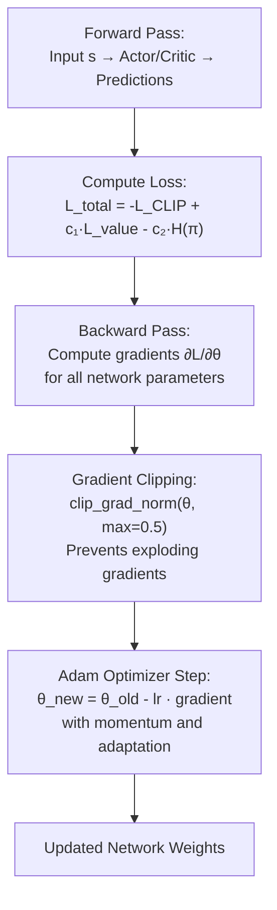

## **12.2 Gradient Clipping**

Neural network gradients can sometimes become very large ("exploding gradients"), causing unstable training. Gradient clipping limits the total gradient magnitude:

$$\text{If } \|\nabla L\| > 0.5: \quad \nabla L \leftarrow 0.5 \cdot \frac{\nabla L}{\|\nabla L\|}$$

## **12.3 Adam Optimizer**

Adam (Adaptive Moment Estimation) is used instead of vanilla SGD because it:

- Maintains per-parameter learning rates (adaptive)
- Uses momentum to smooth noisy gradients
- Converges faster than standard gradient descent

**Learning rates:**

- Actor: $\text{lr} = 3 \times 10^{-4}$ (learns slowly — policy stability)
- Critic: $\text{lr} = 1 \times 10^{-3}$ (learns faster — value accuracy)

---

# **13. Training Loop**

## **13.1 The Complete Training Cycle**

The training process operates in two nested loops:

**Outer loop (Rollout Collection):** Gather 2048 timesteps of experience by running the agents in the environment.

**Inner loop (PPO Optimization):** Use the collected experience to update the neural networks for 10 epochs.

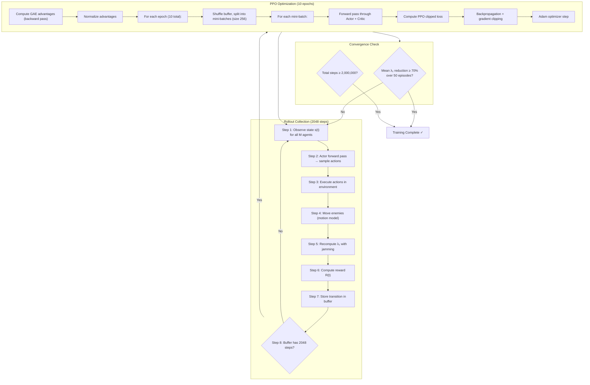

## **13.2 Training Timeline**

| Phase                     | Steps              | What Happens                                                    |
| ------------------------- | ------------------ | --------------------------------------------------------------- |
| Early training (0–100K)   | Random exploration | Agents move randomly, try different bands. Reward is low.       |
| Mid training (100K–300K)  | Learning begins    | Agents start moving toward clusters and selecting correct band. |
| Late training (300K–500K) | Refinement         | Agents fine-tune positions, learn coordination, reduce overlap. |
| Convergence (500K+)       | Stable policy      | Consistent high λ₂ reduction. Ready for deployment.             |

## **13.3 Hyperparameter Summary**

| Parameter       | Value   | Role                                      |
| --------------- | ------- | ----------------------------------------- |
| γ (gamma)       | 0.99    | Discount factor — value of future rewards |
| λ_GAE           | 0.95    | GAE smoothing — bias-variance tradeoff    |
| ε (clip)        | 0.2     | PPO clip range — policy stability         |
| lr_actor        | 3×10⁻⁴  | Actor learning rate                       |
| lr_critic       | 1×10⁻³  | Critic learning rate                      |
| c₁              | 0.5     | Value loss weight                         |
| c₂              | 0.01    | Entropy bonus weight                      |
| K_epochs        | 10      | PPO epochs per rollout                    |
| T_rollout       | 2048    | Steps per rollout buffer                  |
| Batch size      | 256     | Mini-batch size for optimization          |
| Max grad norm   | 0.5     | Gradient clipping threshold               |
| Total timesteps | 500K–2M | Training budget                           |

---

# **14. Deployment Phase**

## **14.1 What is Saved After Training**

After training completes, the following files are saved:

| File                | Contents                         | Used During         |
| ------------------- | -------------------------------- | ------------------- |
| `ppo_agent.pt`      | Actor network weights (policy)   | Deployment          |
| `critic_weights.pt` | Critic network weights           | Resume training     |
| `config.json`       | All hyperparameters and settings | Reproducibility     |
| `training_log.csv`  | Per-episode metrics              | Analysis and graphs |

## **14.2 Inference Pipeline (What Happens at Deployment)**

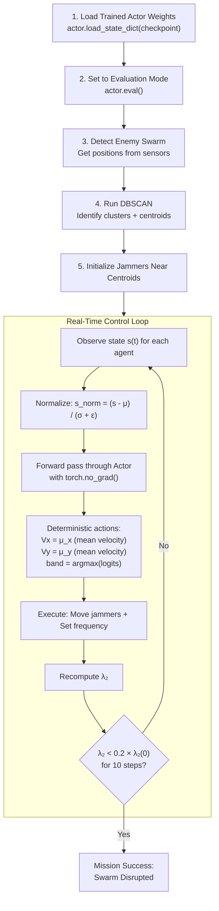

## **14.3 Key Differences: Training vs Deployment**

| Aspect               | Training                               | Deployment                           |
| -------------------- | -------------------------------------- | ------------------------------------ |
| Action selection     | Stochastic (sampled from distribution) | Deterministic (mean of distribution) |
| Band selection       | Sampled from Categorical               | argmax of logits                     |
| Gradient computation | Enabled (backward pass)                | Disabled (torch.no_grad)             |
| Critic network       | Used for value estimation              | Not needed                           |
| Speed                | ~200-400 steps/sec                     | ~1000+ steps/sec                     |
| Latency per step     | ~5ms (with training overhead)          | <1ms (inference only)                |

## **14.4 Termination Conditions**

| Condition  | Trigger                                      | Interpretation         |
| ---------- | -------------------------------------------- | ---------------------- |
| SUCCESS    | λ₂(t) < 0.2 × λ₂(0) for 10 consecutive steps | Swarm disrupted stably |
| FRAGMENTED | λ₂ = 0                                       | Complete disconnection |
| TIMEOUT    | step_count ≥ max_steps                       | Episode ended          |
| MANUAL     | External stop command                        | Operator intervention  |

---

# **15. Final System Flow**

## **15.1 Complete End-to-End Flowchart**

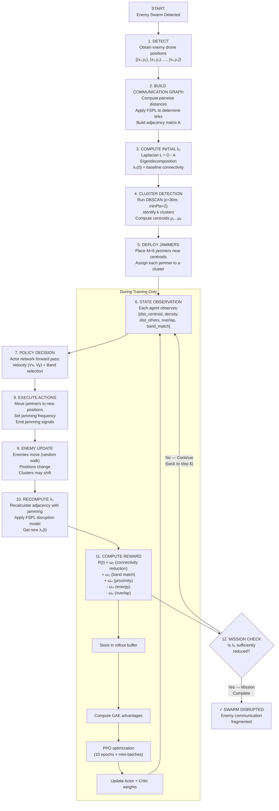

## **15.2 Summary Table**

| Phase                    | Input            | Process                             | Output                     |
| ------------------------ | ---------------- | ----------------------------------- | -------------------------- |
| Detection                | Sensor data      | Position extraction                 | N drone coordinates        |
| Graph Construction       | Positions        | FSPL + distance computation         | Adjacency matrix A         |
| Connectivity Measurement | A                | Laplacian eigendecomposition        | λ₂ value                   |
| Clustering               | Positions        | DBSCAN                              | k clusters + centroids     |
| Jammer Deployment        | Centroids        | Nearest centroid assignment         | Initial jammer positions   |
| Observation              | Env state        | Feature computation + normalization | 5D state vector per agent  |
| Policy                   | State            | Actor neural network                | Velocity + band per agent  |
| Execution                | Actions          | Physics simulation                  | New positions + jamming    |
| Reward                   | λ₂(t), positions | 5-term reward function              | Scalar reward signal       |
| Training                 | Rollout buffer   | PPO with GAE                        | Updated network weights    |
| Deployment               | Trained weights  | Deterministic inference             | Real-time jamming commands |

---

## **Key Theoretical Foundation**

**Proposition 1 (Fiedler, 1973):** λ₂ = 0 if and only if the graph is disconnected.

This means our reward function directly optimizes for **the mathematically guaranteed condition** for swarm fragmentation. When our agents successfully drive λ₂ to 0, the enemy swarm **provably** cannot maintain global coordination.

This is not a heuristic or approximation — it is a mathematical theorem that forms the theoretical backbone of the entire system.

---

_MARL Jammer System — Complete Pipeline Documentation_

_PPO Actor–Critic | Graph Laplacian Reward | FSPL Jamming | DBSCAN Clustering_
